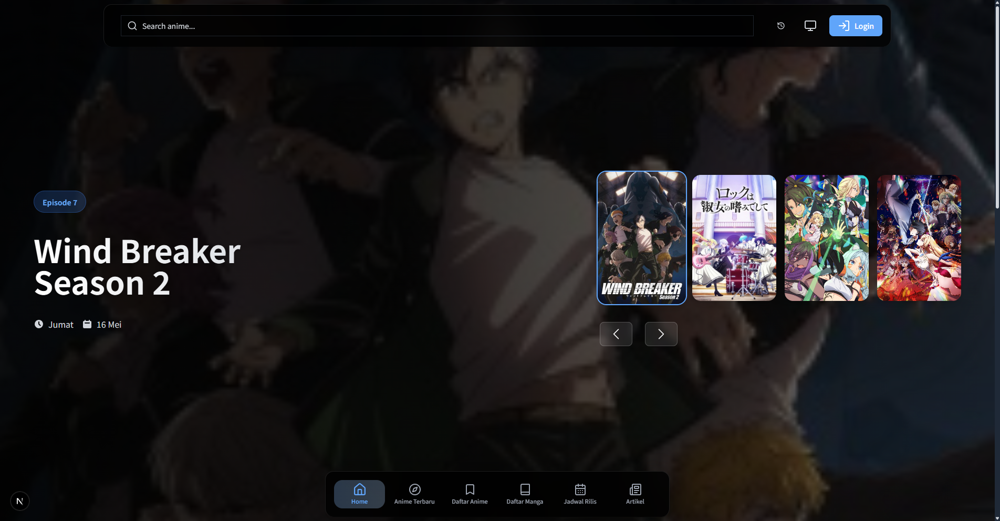

<h1 align="center">Riznime</h1>

  <b>Modern Streaming Platform for Anime, Manga, and Donghua</b> 
  

  
  
  
  
  

---

## ✨ Features

- 🎬 <b>Anime Streaming:</b> Watch the latest episodes across genres
- 📚 <b>Manga Library:</b> Read a vast collection of manga online
- 🏮 <b>Donghua:</b> Chinese animation with Indonesian subtitles
- ⭐ <b>Bookmarks & History:</b> Save favorites and track your watch/read history
- 👤 <b>User Profiles:</b> Personalize your experience
- 💻 <b>Modern UI:</b> Responsive, clean, and user-friendly design

---

## 🛠️ Tech Stack

- <b>Next.js</b> (React Framework)
- <b>TypeScript</b>
- <b>Tailwind CSS</b>
- <b>@react-three/fiber</b> (Three.js React renderer)
- <b>Firebase</b> (Authentication & Database)
- <b>ImageKit</b> (CDN & Image Optimization)
- <b>Flowbite</b> (UI Components)

---

## 📸 Preview

---

## 🌐 Connect with Us

- <a href="https://www.instagram.com/rzkir.20">Instagram</a>
- <a href="https://www.tiktok.com/@rzkir.20">TikTok</a>
- <a href="mailto:rr8027896@gmail.com">Email</a>